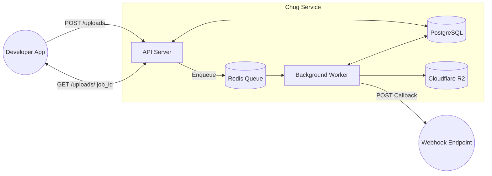

# music_core

> Personalised Nigerian music recommendation system.
> Academic ML project demonstrating collaborative filtering with Explainable AI.

## Services

| Service    | Stack              | Deploy       |
|------------|--------------------|--------------|
| `ml/`      | Python + FastAPI   | Render.com   |
| `backend/` | Python + FastAPI   | Render.com   |
| `frontend/`| React.js           | Vercel       |

## Architecture

## Local Development

See README.md in each service folder for setup instructions.
